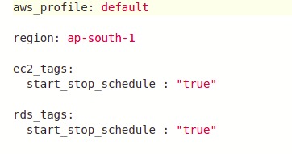
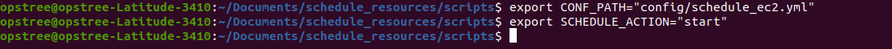
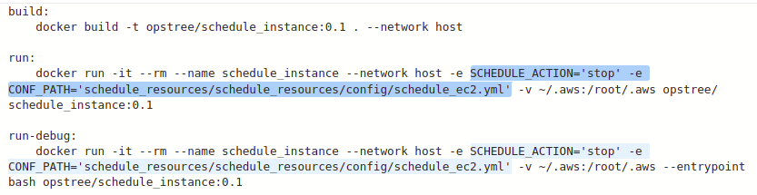
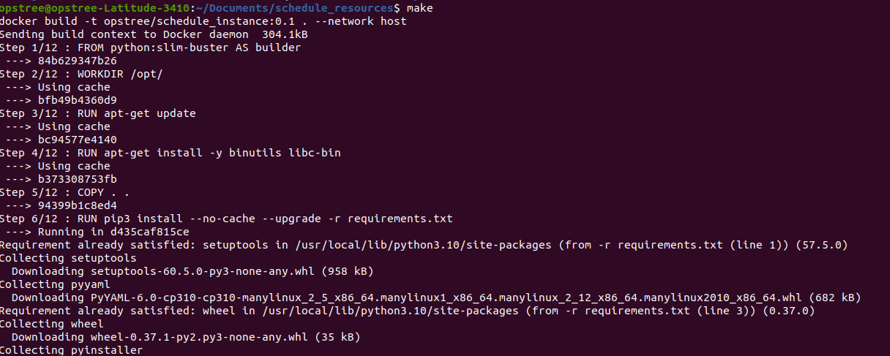

# BP-ICEMAN 

As **ICEMAN** has capability to freeze objects, similarly I'll help to freeze/unfreeze AWS resources by stopping/starting it based on user-defined tags and user-defined actions.

## SERVICES SUPPORTED
- EC2
- RDS

## CONFIGURATIONS 
Configuration for this utility will be managed in YAML format. Below are the configurations details :

- ***aws_profile (Optional) :*** It is a aws profile that you can use to a perform start/stop resources actions in AWS. If not specified, then utility will use default credentials.

- ***aws_region (Optional) :*** The AWS Region where this utility is executed.

- ***ec2_tags (Optional) :*** Tags given to ec2 instances.This utility will start/stop all the ec2 instances matches to this given tags.

- ***rds_tags (Optional) :*** Tags given to rds .It will start or stop all the rds matches to this given tags.

## SAMPLE CONF FILE



## USAGE

===============================================================

### LOCALLY
To run this utility locally from your system.Follow below steps.
- Clone this repo link.
- Make changes to configuration files as required i.e config/schedule_resources.yml.
- Export two environment variables .
   - ***CONF_PATH:*** Path of the configuration file.
   
   - ***SCHEDULE_ACTION:*** Action which is  going to perform i.e start or stop.

  


- Run the python script.

``` python3 schedule_resources.py```

### USING DOCKER
To run this utility using docker.Follow below steps.
- Clone this repo.
- Make changes to configuration files as required i.e config/schedule_resources.yml.
- Then do some  changes in Makefile i.e set the path of configuration file (CONF_PATH) and set  value of  SCHEDULE_ACTION(***start*** or ***stop***) which is going to perform .



- Execute the ***make*** command . 




 
