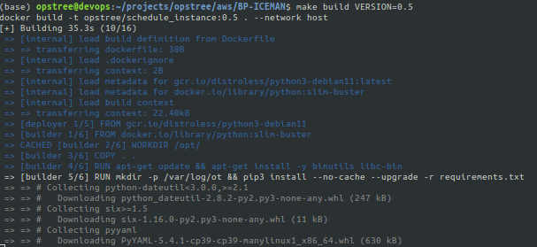
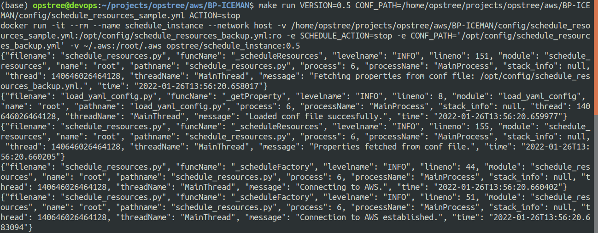

# BP-ICEMAN 

As **ICEMAN** has capability to freeze objects, similarly I'll help to freeze/unfreeze AWS resources by stopping/starting it based on user-defined tags and user-defined actions and increase or descrease the replica count of the K8s resources(Deployment and Statefulset) on the basis of annotation.

## SERVICES SUPPORTED
- EC2
- RDS
- k8s
    - Deployment
    - Statefulset


## SAMPLE CONF FILE

```
aws:
  ec2_tags:
    start_stop_schedule : "true"
  region: us-east-2
  rds_tags:
    start_stop_schedule : "true"
  aws_profile: trademo

k8s: 
  context: "internal-trademo.com"
  namespaces: ["default","test"]
  replicas: 3
  deployment_annotations:
    start_stop_schedule : "true"
  sts_annotations:
    start_stop_schedule : "true"

actions_on:
    - k8s:
        - deployment
        - sts
    
    - aws:
        - ec2
        - rds

```

## USAGE

===============================================================

### LOCALLY
To run this utility locally from your system.Follow below steps.
- Clone this repo.
- Create your configuration file. Can take reference from ```config/schedule_resources_sample_config.yml```.
- Export two environment variables .
   - ```CONF_PATH:``` Path of the configuration file.
   
   - ```AWS_SCHEDULE_ACTION:``` Action which is  going to perform i.e start or stop.

   - ```K8s_SCHEDULE_ACTION:``` Action which is  going to perform i.e resize.
   ```
   export CONF_PATH="${pwd}/BP-ICEMAN/config/schedule_resources_sample_config.yml"
   ```
   ```
   export AWS_SCHEDULE_ACTION="start"
   export K8s_SCHEDULE_ACTION="start"

   ```

- Run the python script.

   ```
   python3 scripts/schedule_resource_factory.py 
   ```

### USING DOCKER

To run this utility using docker.Follow below steps.
- Clone this repo.
- Make changes to configuration files as required i.e config/schedule_resources.yml.
- Build the docker image using Makefile
  ```
   make build VERSION=<Provide image tag here>
  ```
  

- Run the application
  ```
  make run VERSION=<Provide build image tag> CONF_PATH=<Conf-Path> AWS_SCHEDULE_ACTION=<start/stop> K8s_SCHEDULE_ACTION=<start/stop>
  ```
   
